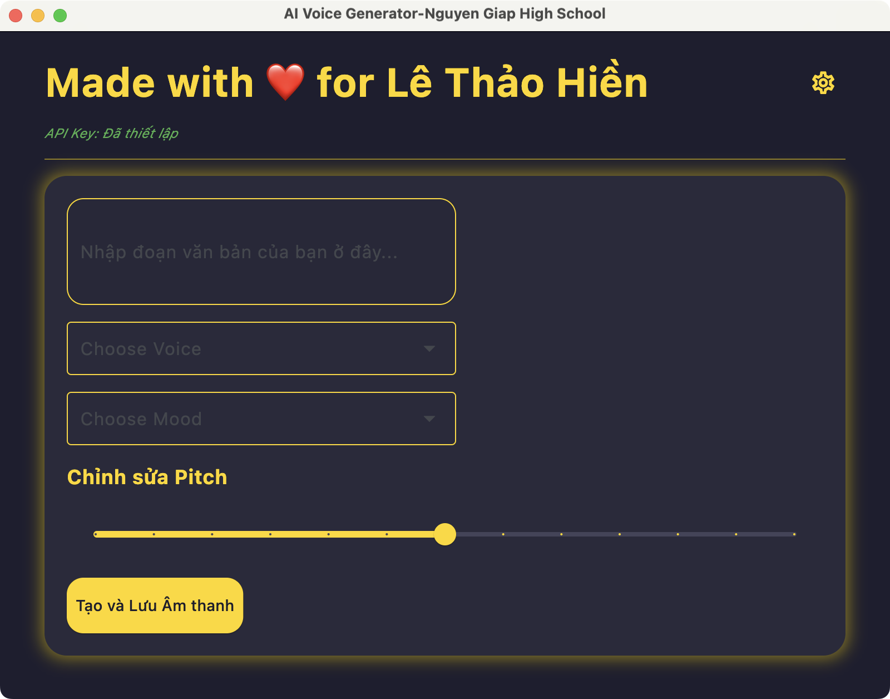

# AI Voice Generator (Flet & Murf.ai)

> Made with ❤️ for Lê Thảo Hiền

A simple desktop application built with Python and Flet to generate AI voice from text using the Murf.ai API.



## Features

*   Multi-line text input for text-to-speech conversion.
*   Select voices from a dynamically updated list of available **US English (en-US)** and **UK English (en-UK)** voices from Murf.ai.
*   Choose appropriate moods/styles for the selected voice.
*   Adjust the pitch of the generated speech.
*   Generate and open a dialog to **save the audio file (MP3)** to a user-selected location.
*   Update the Murf.ai **API Key** through a dedicated settings dialog.
*   Automatically **persists the API Key** in an `api_key.py` file for subsequent runs.
*   Displays the current API Key status (set or not set).
*   User-friendly interface built with Flet.
## Prerequisites

*   **Python 3.11+**
*   **pip** (Python package installer)
*   A **Murf.ai** account and a valid **API Key**. You can obtain your API Key from your Murf.ai account dashboard.

## Installation

1.  **Clone the Repository:**
    ```bash
    git clone https://github.com/trieuntu/AIVoice-MurfAI.git
    cd AIVoice-MurfAI
    ```

2.  **Create and Activate a Virtual Environment (Recommended):**
    ```bash
    # Windows
    python -m venv venv
    .\venv\Scripts\activate

    # macOS/Linux
    python3 -m venv venv
    source venv/bin/activate
    ```

3.  **Install Dependencies:**
   Run:
    ```bash
    pip install -r requirements.txt
    ```

4.  **Configure API Key:**
    *   Add the following line to `api_key.py`, replacing `"YOUR_MURFAI_API_KEY"` with your actual Murf.ai API Key:
        ```python
        API_KEY = "YOUR_MURFAI_API_KEY"
        ```

## Usage

1.  **Run the Application:**
    Open your terminal or command prompt in the project's root directory (with the virtual environment activated, if used) and run:
    ```bash
    python main.py
    ```
    *(Or `python3 main.py` depending on your system configuration)*

2.  **Using the Interface:**
    *   Enter the text you want to convert in the large text area.
    *   Select a Voice and Mood from the dropdown menus.
    *   Adjust the Pitch slider if desired.
    *   Click the **"Generate and Save Audio"** button.
    *   A file dialog will appear; choose a location and filename to save the MP3 file.
    *   The audio file will play automatically after saving.

## Technology Stack

*   **[Flet](https://flet.dev/)**: Build cross-platform Flutter frontends in Python.
*   **[Murf Python Library](https://github.com/murf-ai/)**: Python client for the Murf.ai API.
*   **[Requests](https://requests.readthedocs.io/en/latest/)**: Python library for making HTTP requests (used for downloading the audio file).

## License

This project is licensed under the MIT License. See the `LICENSE` file for details (You should create a `LICENSE` file containing the MIT license text).

---